<p align="center">
  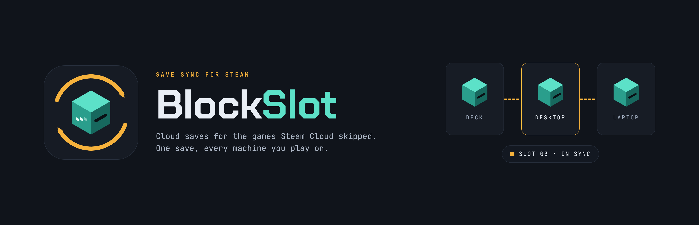
</p>

<p align="center">
  <b>Your game saves, on every device you play on.</b><br>
  Save sync for the games Steam Cloud does not cover, on a server you own.
</p>

<p align="center">
  <a href="https://github.com/datbird/blockslot/releases/latest">Download</a> ·
  <a href="#get-started">Get started</a> ·
  <a href="server/README.md">Server</a> ·
  <a href="decky/README.md">Steam Deck</a> ·
  <a href="gui/README.md">Windows</a>
</p>

---

You play on the PC, pick up the Steam Deck later, and the save is not there.
Steam Cloud covers some games and not others. Emulators, games from other
stores and anything added to Steam by hand are left to you. A sync folder that
copies files both ways will happily put the older save over the newer one.

BlockSlot fixes that for the games Steam misses:

- **Before a game starts,** it restores the newest save from any of your
  devices.
- **When the game closes,** it uploads the save. Offline, the save waits in a
  queue and goes up later.
- **Every save is kept** as a snapshot with its history. Nothing is ever
  overwritten.
- **Two devices played from the same save?** It asks which one to keep. It
  never guesses.
- **Emulators too.** A RetroArch, RetroBat or RetroDECK saves folder is split
  into one save per game, and each game keeps its own history.

<p align="center">
  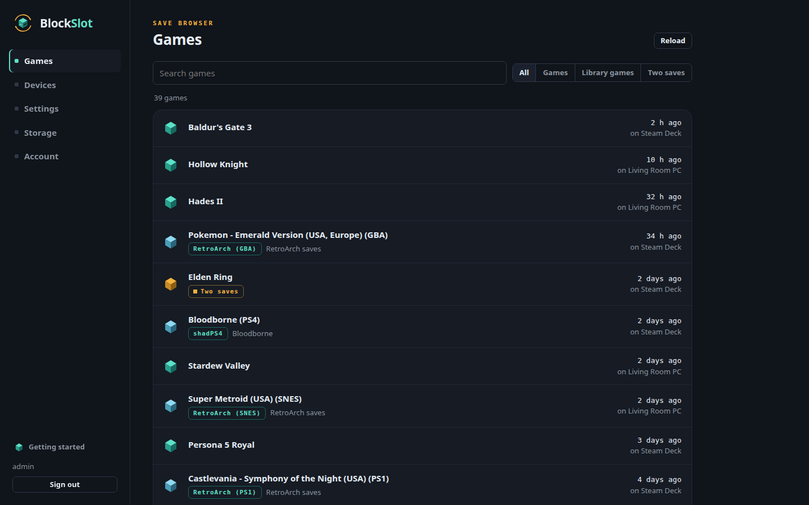
</p>

## How it fits together

```
  Windows PC                Steam Deck               any other device
  BlockSlot.exe             BlockSlot for Decky
        \                         |                         /
         \  upload on exit, restore before start          /
          `---------------.       |       .--------------'
                           v      v      v
                 blockslot-server  (your NAS, one container)
                 S3 store (Garage)  +  web UI on :8761
```

- **The server** holds every save and has a web page for your games, devices
  and the settings they share. One Docker container. Unraid has a template.
- **Each device** runs a small daemon that uploads and restores. On Windows it
  is a service with a tray icon. On the Deck it lives inside the Decky plugin.
- **Steam starts the game through BlockSlot.** Turning sync on for a game sets
  its launch option, and BlockSlot then runs the game itself. Steam's files
  are never edited by hand.

## Get started

### 1. The server

On Unraid, search for **BlockSlot** in the Apps tab. Anywhere else:

```
docker run -d --name blockslot-server --restart unless-stopped \
  -p 3900:3900 -p 8761:8761 \
  -v /path/to/blockslot:/data \
  ghcr.io/datbird/blockslot-server:latest
```

Open `http://<server>:8761`. A short guide asks for what it needs: an admin
account, the address devices use, and your emulators if you have any. Then it
adds your first device. More in [the server's README](server/README.md).

### 2. Windows

1. Download `BlockSlot-<version>-windows-x64.zip` from the
   [latest release](https://github.com/datbird/blockslot/releases/latest).
2. Unzip it to a folder of its own and run `BlockSlot.exe`. It needs nothing
   else installed. Settings offers to fetch ludusavi.
3. On the server's **Devices** page, add this PC. In BlockSlot, open
   **Store**, enter the address and pairing code it shows, and choose
   **Pair with the server**.
4. On **Games**, turn sync on for the games you play.

### 3. Steam Deck

The plugin is waiting for review in the Decky store. Until then:

1. In Decky, open Settings and turn on **Developer mode**.
2. Under **Developer**, choose **Install Plugin from URL** and give it the
   `...-decky.zip` link from the
   [latest release](https://github.com/datbird/blockslot/releases/latest).
   To build it yourself instead, see
   [install from source](https://github.com/datbird/blockslot-decky#install-from-source).
3. On the server's **Devices** page, add the Deck. In the plugin, open
   **Server**, enter the address and the code, and pair.
4. On **Games**, turn a game on.

## Screenshots

### The server

| | |
|---|---|
| 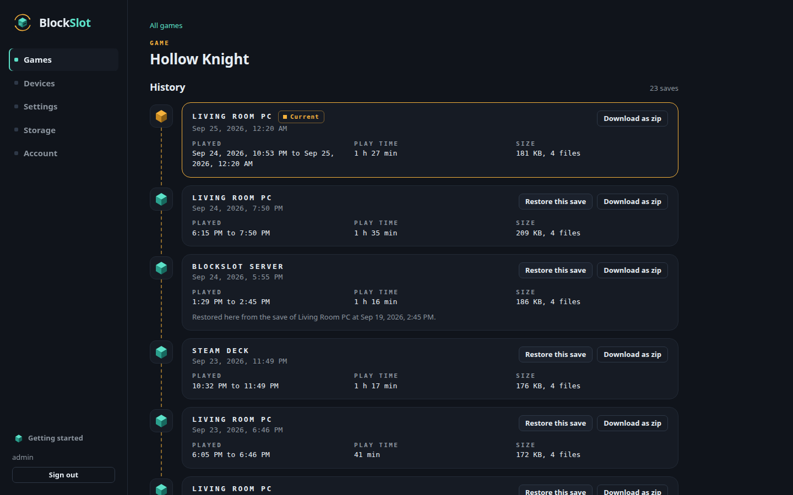 | 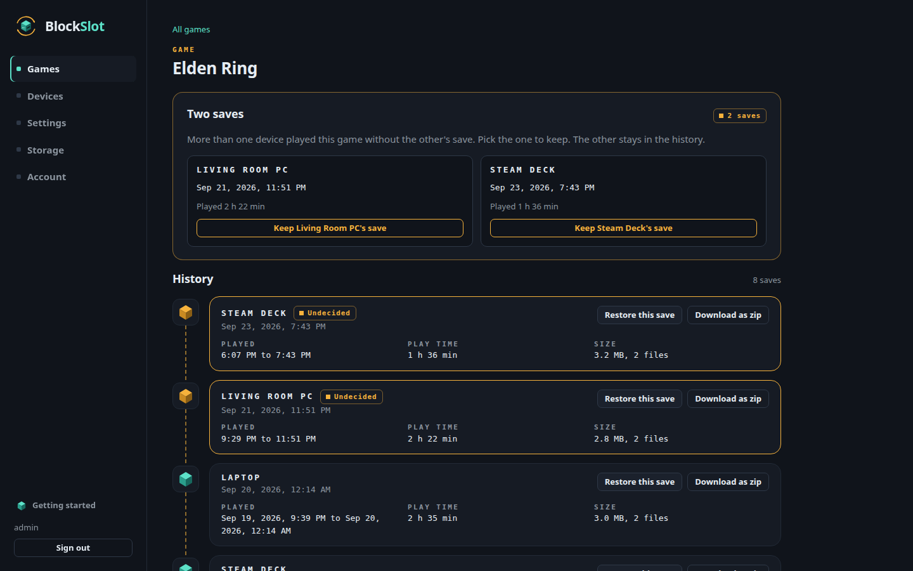 |
| 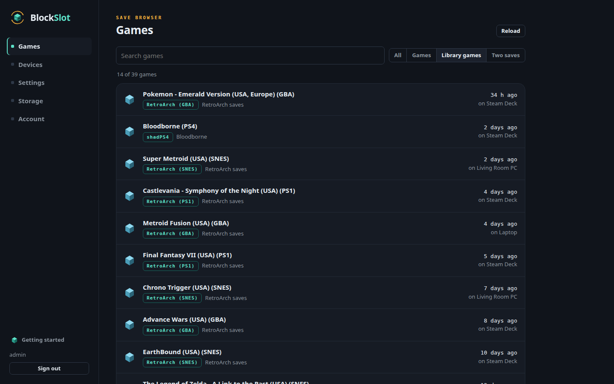 | 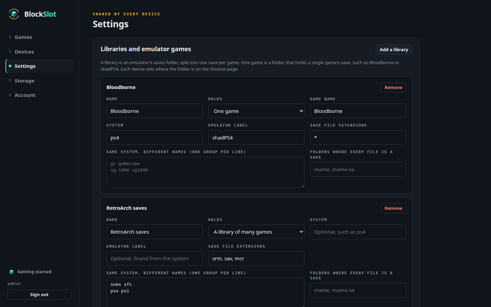 |
| 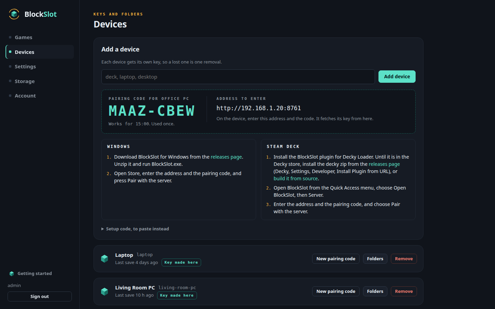 | 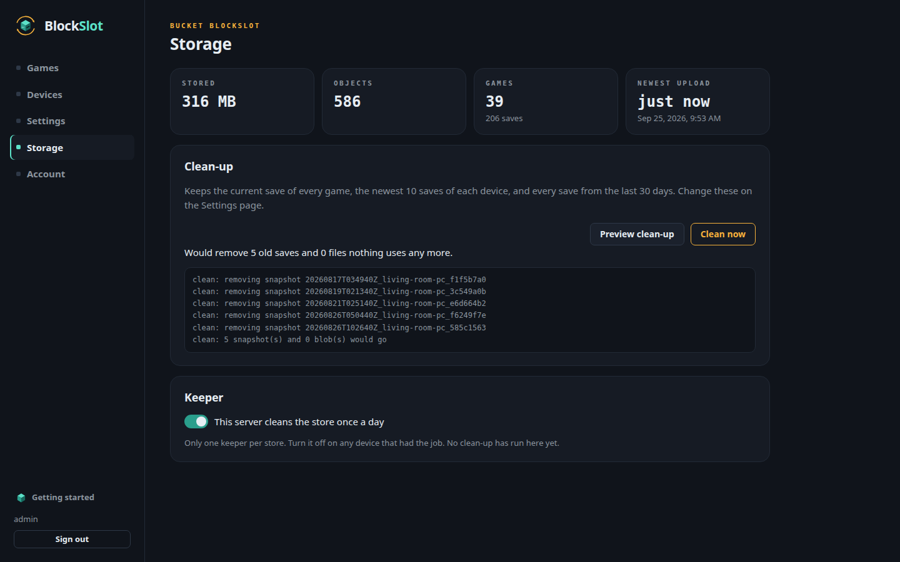 |

### Windows

| | |
|---|---|
| 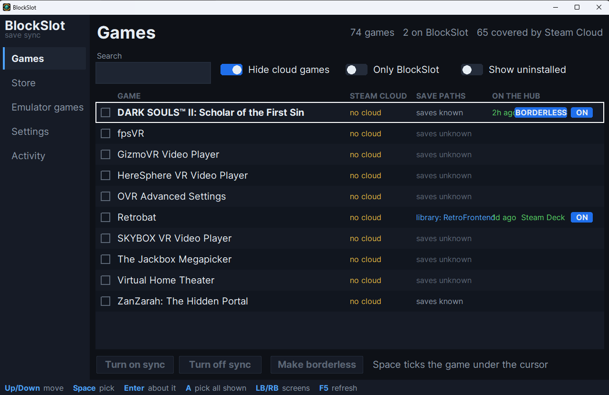 | 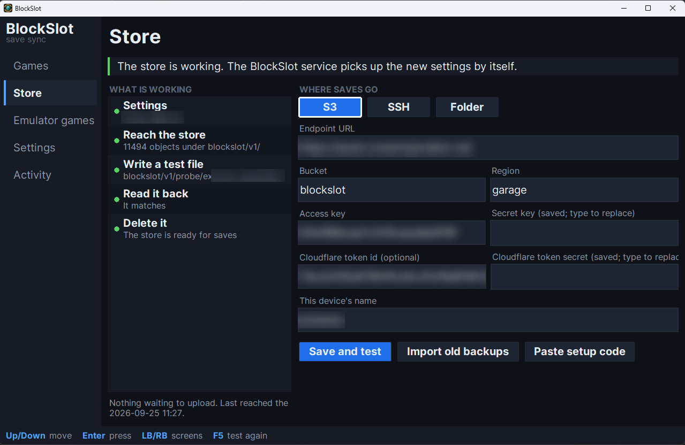 |
| 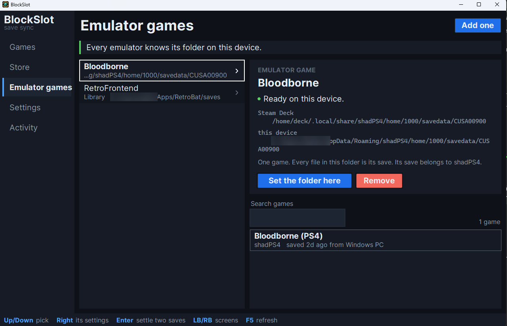 | 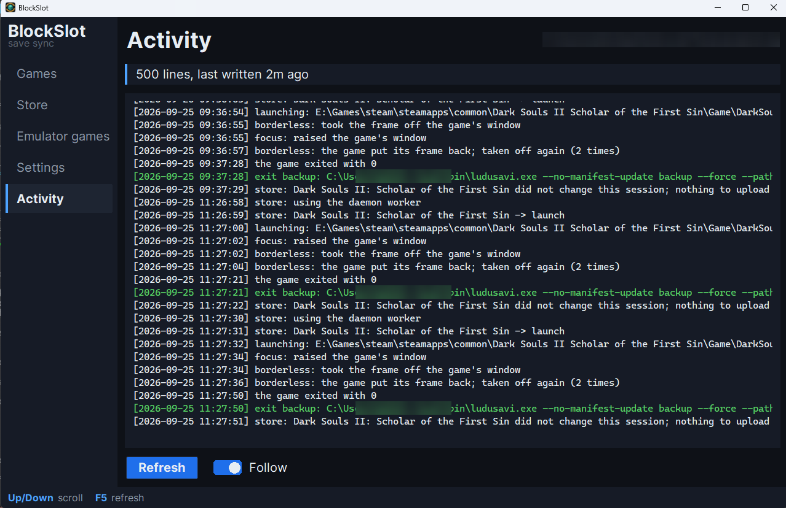 |

### Steam Deck

| | |
|---|---|
| 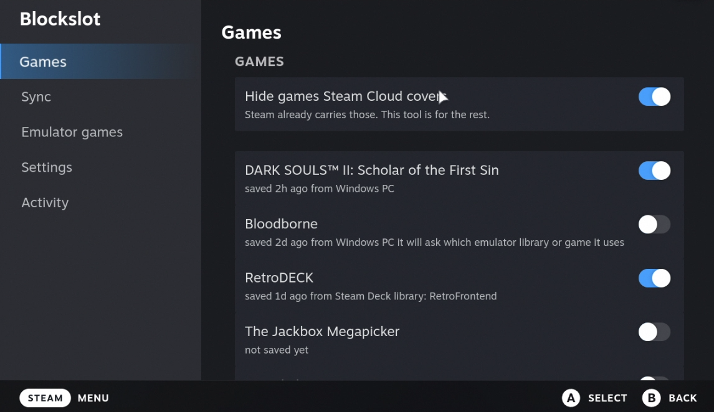 | 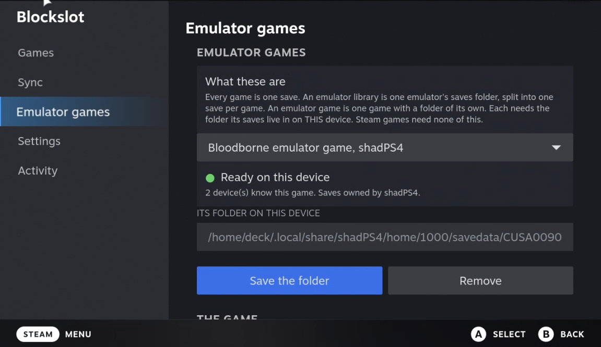 |
| 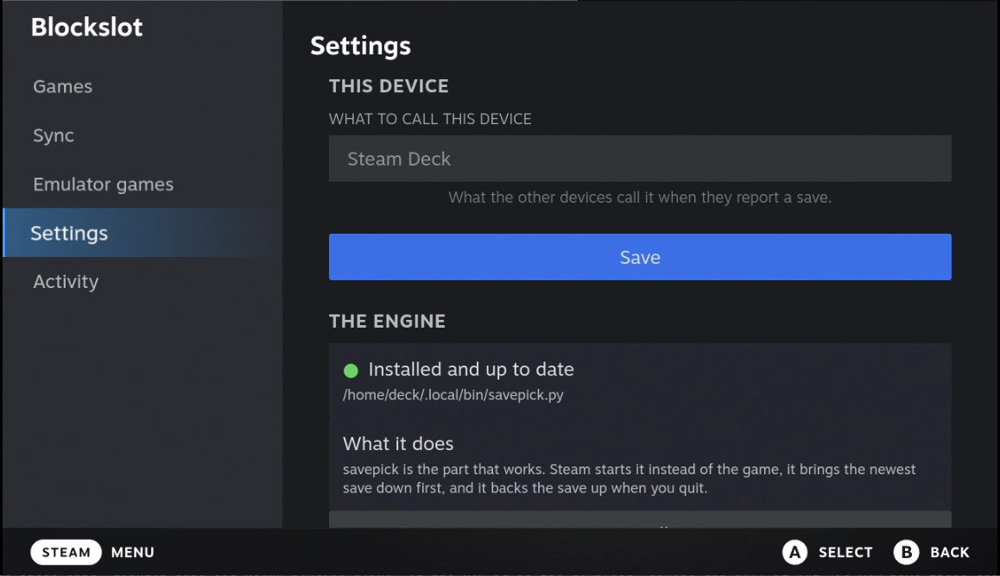 | 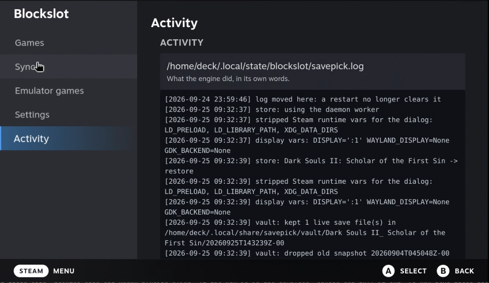 |

<p align="center">
  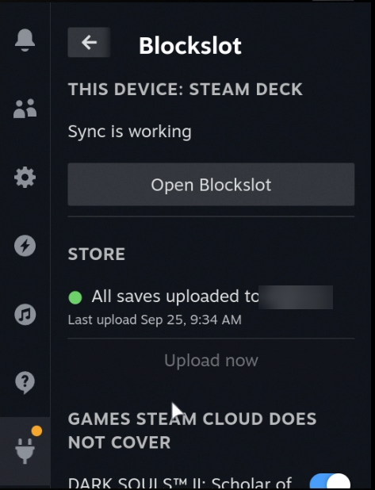
</p>

## What it is not

- **Not a replacement for Steam Cloud.** Games Steam Cloud covers can stay
  with Steam. BlockSlot hides them by default.
- **Not a cloud service.** There is no account and nothing leaves your
  network unless you put the server behind something like Cloudflare Access.
  The server supports that, for sign-in and for device tokens.
- **Not a backup of your whole PC.** It carries game saves, and only for the
  games you turn on.

## Building from source

Everything on a device is the Python standard library. Nothing is installed
with pip to run it.

| Part | Where | Build |
|---|---|---|
| Server | `server/` | `docker build -f server/Dockerfile -t blockslot-server .` |
| Windows app | `gui/` | `python tools/build_exe.py` (PyInstaller, build time only) |
| Decky plugin | `decky/` | `pnpm install && pnpm build && python3 scripts/package.py` |
| Engine | `engine/` | nothing to build: one file per job, shared by every device |

```
engine/     the save picker Steam starts, the store client, the device daemon
gui/        the desktop app. gui/core holds every rule; gui/ui draws them
decky/      the SteamOS plugin. It carries a staged copy of gui/core
server/     the container: Garage and the web UI
index/      games.json: which files are saves, which games Steam Cloud covers
tools/      the index generator and the Windows build
```

Tests run on every push, on Windows, macOS and Linux:

```
python engine/test_savepick.py
python gui/tests/run.py
python -m unittest discover server/tests
```

## Status

In daily use by its author on a Windows PC and a Steam Deck. The server is
new. Bug reports and pull requests are welcome in
[issues](https://github.com/datbird/blockslot/issues).

## License and credit

MIT. See [LICENSE](LICENSE).

BlockSlot drives [ludusavi](https://github.com/mtkennerly/ludusavi) for every
backup and restore. Its game index is derived from
[ludusavi-manifest](https://github.com/mtkennerly/ludusavi-manifest), which is
compiled from [PCGamingWiki](https://www.pcgamingwiki.com). The server stores
saves with [Garage](https://garagehq.deuxfleurs.fr). Full notices are in
[THIRD-PARTY-NOTICES.md](THIRD-PARTY-NOTICES.md).
